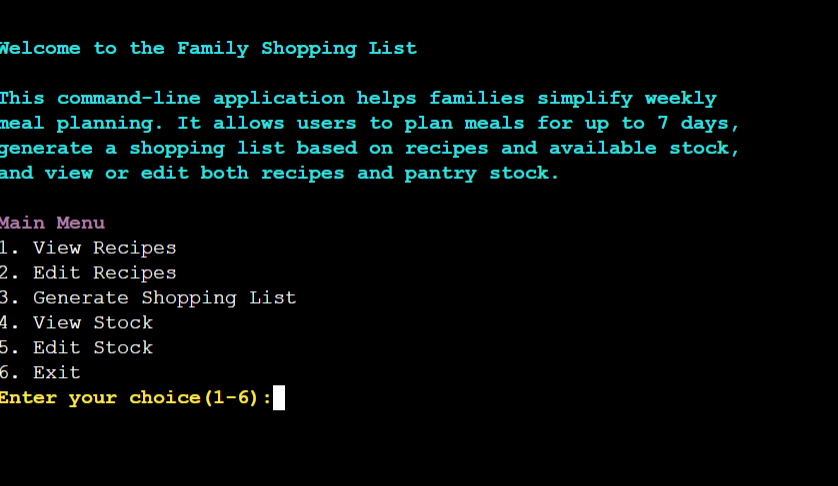

  

## Table of Contents

1. 

     
<a href="#about">About</a>

   <a href="https://github.com/David5p/family_shopping_list">Family Shopping List</a> project is a program designed for parents or guardians to create a food shopping list for the family.

   Users of the program are invited to choose from a list of options. The primary goal leads to the creation of a shopping list for either 2 or 7 days depending on the user's choice.

    

        
    

    
    Other avenues the user can change include the respective stock and recipes list.

   

2. 

     
User Experience

     <ul>
       <li>
         

           
Goals

           <ul>
             <li><a href="#visitor-goals">Visitor Goals</a></li>
             <li><a href="#business-goals">Business Goals</a></li>
             <li><a href="#user-stories">User Stories</a></li>
           </ul>
         

       </li>
       <li>
         

           
Visual Design

           <ul>
             <li><a href="#project-board">Project Board</a></li>
             <li><a href="#Flowcharts">Flowcharts</a></li>
             <li><a href="#colors">Colors</a></li>
           </ul>
         

       </li>
     </ul>
   

3. 

     
Features

     <ul>
       <li>
         

           
Page Elements

           <ul>
             <li><a href="#View Recipes">View Recipes</a></li>
             <li><a href="#Edit Recipes">Edit Recipes</a></li>
             <li><a href="#Generate Shopping List">Generate Shopping List</a></li>
             <li><a href="#View Stock">View Stock</a></li>
             <li><a href="#Edit Stock">Edit Stock</a></li>
             <li><a href="#Exit">Exit</a></li>
           </ul>
         

       </li>
       <li>
         

           
Technologies Used

           <ul>
             <li><a href="#languages">Languages</a></li>
             <li><a href="#frameworks">Frameworks</a></li>
             <li><a href="#libraries">Libraries</a></li>
             <li><a href="#platforms">Platforms</a></li>
             <li><a href="#other-tools">Other Tools</a></li>
           </ul>
         

       </li>
     </ul>
   

4. 

     
Testing

     <ul>
       <li>
         

           
Methods

           <ul>
             <li><a href="#validation">Validation</a></li>
             <li><a href="#general-testing">General Testing</a></li>
             <li><a href="#Refactoring">Refactoring</a></li>
             <li><a href="#User Story reflection">User Story Reflection</a></li>
           </ul>
         

       </li>
       <li>
         

           
Bugs

           <ul>
             <li><a href="#known-and-fixed-bugs">Known and Fixed Bugs</a></li>
           </ul>
         

       </li>
     </ul>
   

5. 

     
Deployment

     <ul>
       <li><a href="#deployment">Deployment Details</a></li>
     </ul>
   

6. 

     
Credit

     <ul>
       <li><a href="#content">Content</a></li>
     </ul>
   

---

# User Experience (UX)

## Goals

### Visitor Goals

The target audience for the program:

- Parents or guardians looking to plan meals.
- Any adult wanting to plan their meals.
- Students or educators looking to develop an understaning of Python concepts

User goals are:

- To generate a shopping list.
- View and change stock list.
- View and change recipes list

The Family Shopping List fulfills these needs by:

- Users are prompted of their requirements to generate the shopping list.
- Users can choose to edit, remove or add stock items.
- Users can choose to edit, remove or add recipes.

### Business Goals

The Business Goals of Family Shopping List are:

- To save the user time by generating accurate and personalized shopping lists.
- To reduce the stress of meal planning and shopping.
- To have the potential to reduce household waste through accurate updating of stock list and following the meal plan.

### User Stories

1. As a family member, when using the command line navigation, I need a clear system which flows in the terminal and does not break down. I want to be guided through menu options clearly, so that I can update the food stock and create a shopping list without needing technical skills.

2. As a user, I want the program to tell me what to buy based on current stock and provided meal plan, So that I don’t forget anything when shopping.

3. As a user, I want to see what food items I currently have in stock, so that I can plan meals more effectively.

4. As a user, I want to reduce quantities or delete expired items from my stock, so that the data remains accurate.

5. As a user, I want to add new recipes or change existing ones, so that my meal plan is personalized.

6. As a user, I want to assign meals to specific days, so I can plan the week more precisely.

7. As a user, I want to save my weekly meal plans, so I can reuse or review them later.

## Visual Design

### Project Board

- I used the projects board to help me plan my program. I have found it a useful check guide since it was introduced and have decided to continue using it on my projects.
- The plan allowed me to focus on achieving what was most important to achieve in my program first before attempting to achieve other features.
- For example, I was able to focus on allowing the user to view recipes and stock lists and generate the shopping list before taking the development of the program further.
- It is also a useful tool to see how I could develop my program in the future or without time constraints.

### Flowcharts

  

- I used LucidChart to help me plan my project and outline the logic for some of the bigger functions.
- As you can see in the picture above, my initial outline for the project links to my project board by including my must-haves of viewing and loading the stock and recipes before the option to generate a shopping list.
- I found LucidChart a useful avenue to help me plan my project and provide a focus and a reference of the direction of the project.

  

- The logic for some of my functions was more difficult and contained function calls within them.
- Using LucidChart helped simplify the more difficult functions such as the edit recipes function. The flowchart helped me understand this was a complex task and initially I created this as one function before refactoring it later in my project.
- This flowchart helped me understand the steps which needed to be taken to edit recipes and the options the user needed to be taken to based on their choices.
- The flowchart was also useful for error handling as from the flowchart I knew the options I wanted to display to the user and what the next step should be after they make their choice.

  

- The edit stock function was another function which required steps to understand the logic flow.
- The use of LucidChart assisted me understanding the flow of this option for the user and ensuring the user experience is cohesive.
- This flowchart also helped me understand that I wanted the user to remain in the loop until they choose to exit. This means if the user decides to they can edit multiple items in the stock list.

  

- The generate shopping list function is fundamental to the terminal oreintated program.
- The flowchart helped me understand the logic behind the need to take in the recipes from the user, assess this against existing stock and create a shopping list.
- This visualization also supports debugging, and helps identify potential improvements or errors in the function. Overall, this flowchart is a valuable tool for documenting the function’s purpose and flow, making future updates or need to refactoring easier and more efficient.

### Colors

  

- I chose to use the colorama librart for the text colors to display in the terminal. This helped to provide uniformity and create a differential for the different choices and responses the user recieves.
- Originally, I used only Fore.Color but found this alone resulted in the appearance of a dark text. The addition of Style.BRIGHT made the text colors contrast well with the black terminal background.
- I chose the color red to display error messages, green for success messages, yellow for when the user is asked for an input, white for menu information and for the stock and recipe list. Finally, I chose magenta for the Main Menu. These color choices remain consistent throughout the program and provide a better user experience than all text displayed in white as seen below.

# Features

## Page Elements

#### View Recipes

- When the user comes to the terminal interface Main Menu they can choose View Recipes by selecting number 1.
- This option allows the user to view the recipes before deciding which meals they want to plan for to create the shopping list.

#### Edit Recipes

- Option 2 gives the user greater control over the recipe list. They can edit, add or delete recipes by following the clear instructions in the terminal.
- This option is very useful and gives the user the opportunity to engage with the recipes and make the program individualised to them.

  

#### Generate Shopping List

- The Generate Shopping List option is the primary purpose of the program.
- I encountered a number of issues creating this function which I will detail fully in the testing section but changing the function to allow the user to select numbers next to each recipe rather than typing out each recipe made the program user friendly.

#### View Stock

  

- When the user comes to the terminal interface Main Menu they can choose View Stock by selecting number 4.
- This option allows the user to check what existing items they have and make informed decisions when editing stock or generating a shopping list.

#### Edit Stock

- This option provides engagement with the user where they can update the stock list through the terminal.

- The user can choose to edit an existing item, remove an item or add a new item.

  

- I created the stock as a stand alone list but I recognise that the table format is user friendly. It allows the user to clearly see the item name, quantity and units of each product in stock.

#### Exit

- The last option lets the user exit the program when they are finished.

# Technologies Used

## Languages

- **Python**  
  Backend Development.

## Libraries

- [Colorama](https://pypi.org/project/colorama/)  
  Text color.
- [Difflib](https://docs.python.org/3/library/difflib.html)  
   To handle fuzzy matching for the user's input -[Collections] (https://docs.python.org/3/library/collections.html)
  To allow recipes to be counted

## Platforms

- [GitHub](https://github.com/)  
  Storing code remotely.
- [Visual Studio Code](https://code.visualstudio.com/)  
  IDE for project development.
- [Heroku](https://www.heroku.com/)
  For deployment of site

## Other Tools

- [LucidChart](https://www.lucidchart.com/)  
  Used to plan out the program and the bigger functions.

# Testing

## Methods

### Validation

  

- I used Flake8 to check my code. As you can see from the above image, I had many errors of a similar type. Flake8 helped me realise indentatation errors and trailing white space on lines.

- The errors about lines being too long were discussed at my second mentor meeting and I recieved guidance on how separate into 2 lines through either additional quotation marks or starting a new line when I opened brackets.

  

- I also had some errors with trailing variables. I created a number_of_days variable for my meal plan but this was rendered obselete by using a counter so I never used this variable and deleted it. Similarly, I had a categories variable trailing in my edit_recipes function. I had declared the categories variable in my new refactored function category_choices but had neglected to remove it from my edit_recipes function

- The new_qty variable error was creating an issue because I was trying to use the variable without having declared. I went into my code and declared it to fix the problem. After solving all of these issues when I run Flake8 in the terminal I have no errors.

  

- I used pip install mypy to validate the types used in my python code.

  

-It threw 1 error related to Colorama which does not include type hints. I found a [GitHub](https://github.com/pantsbuild/pants/issues/20259) comments section which raised a similar issue. The problem was resolved by installing colorama types. I have no erros in mypy now.

  

### General Testing

- The website was tested across Google Chrome, Safari, Mozilla Firefox and the mobile test was done on an Asus Zenfone 9 and no issues were found.

  

- Each time new features and behaviors were added the preview and the deployed site were checked for functionality.

- The terminal interface was tested by friends on both mobile and desktop devices. I and my friends recognise the the program functions better on desktop screens.

  

- I tried to input different things to get the program to break such as spaces, question mark, empty input but found my program either remained in the loop or recognised the error and asked the user to try again.

- The user stories provided a noteworthy reference point and I was allowed to ensure and test that all of the must haves were achieved for the website.

- I recognise that if I were to develop this project, I would add more functionality. I would add in an option of what can I make from my current stock if I do not intend to go to the shop. I would also like to add more categories to the stock section such as toiletries, drinks and baby/toddler food to make it a complete family shopping list and not just limited to food.

### Refactoring and User input

- My code was not following best practice of the single responsibility function. My edit_recipes function contained functions within functions and the code needed to be refactored.

  

- My edit_recipes function was overloaded so from the image above, I created functions which I then called in the edit_recipes function. Namely I created a Category and a handle_new_recipe function. These two helper functions helped my code adhere to best practice.

  

- In my first draft of the project the user was required to input each recipe they wanted to make rather than the number selection in this finished version.
- The user inputting each recipe this was a problem if they made spelling mistakes or didn't use capital letters. For instance, when the user typed lasagne it didn't come up because the user did not use a capital L.

  

- This issue was fixed using fuzzy matching. However my mentor pointed out if a user has to write 14 recipes for a weekly shopping list it makes the program quite cumbersome which is why I switched to numbers for the recipes.

- I then transferred the fuzzy matching to be called in my edit_stock function as it is a more appropriate match with the user editing one item at a time.

  

### User Story Reflection

- During the testing process and I looked back at my user stories to see if I achieved all of my Must-haves.

- The command line navigation works well and I have not got the program to fail in testing.

- The user can generate a shopping list by inputting their meal choices and it will measure this against the current items in stock.

- The user can view stock and view recipes easily by selecting the respective option from the main menu.

- The user can edit both the existing stock and recipes and each one will be updated.

- For future development, the user would be able to select meals for each day and could save their weekly meal plan so that it can be reused. Other ideas mentioned previously include a complete family shopping list including items such as toiletries.

## Bugs

### Known and fixed Bugs

  

- One bug I found related to both stock and recipes was if the user decides to add a new item to stock or a new recipe to recipes they can use a number. This was confusing as the user could call an ingredient 7 and have a quantity of 7. I corrected this bug by only allowing a string to be submitted.

  

- I found the solution to this in the Python Docs [Python Docs](https://docs.python.org/3/library/stdtypes.html) where I used the
  .isnumeric() method to resolve this issue.

  

- Another bug that was found during testing was the quantity section of the add an ingredient to a recipe. The program allowed the user to type in letters which caused an error.

- This issue was resolve by adding a try and accept ValueError to the edit_existing_ingredient function.

  

- The soley Python based project does not format very well on devices other than desktop. I would explore using other programs to ensure the program usability is improved on mobile devices.

### Deployment

The steps below detail how I deployed my live site:

- The site was deployed to Heroku. The steps taken were as follows:

  - I went to Heroku and verified my student status through GitHub
  - I gave Heroku authentication and accepted their terms and conditions.
  - I clicked create new app on Heroku and was prompted to give the app a name.
  - I then went to Settings and to Config Vars and set the KEY to PORT and the VALUE to 8000.
  - Next in Settings, I went to Buildpacks and added heroku/nodejs and heroku/python.
  - I clicked on the deploy section next and selected Github as my deployment method.
  - I confirmed connect to GitHub and then searched for my repository name and connected it.
  - I then selected automatic deploys and waited for it to load by clicking view.

- To **Fork** the repository:

  - On GitHub.com, navigate to the repository.
  - In the top-right corner of the page, click **Fork**.
  - Choose an owner for the forked repository.
  - Forks are named the same as their parent repositories. You can change the name of the fork.
  - Add a description of your fork if you wish.
  - Choose whether to copy the default branch or every branch to the new fork.
  - Click **Create fork**.

- To **Clone** the repository:
  - On GitHub.com, navigate to the repository.
  - Above the list of files, click the **Code** dropdown button which will bring up a list of options.
  - Where the URL appears in the dropdown, **copy the URL**.
  - Open **Git Bash**.
  - Change the current working directory to the location where you want to keep the cloned directory.
  - Type `git clone` followed by pasting the URL you copied earlier.
  - Press **Enter**, and your local clone will be created.

The live link to the website can be found here: [Family Shopping List](https://family-shopping-list1-3e187ea09412.herokuapp.com/)

## Credit

### Content

- I referred to the Love Sandwiches project for creating my initial structure and what functions I would require.
- The idea of a stock based program was inspired by the Love Sandwiches project
- I used Python Docs a number of times including when I was attempting to solve my aggregating recipes for the shopping list.
  from <a href="https://docs.python.org/3/library/collections.html"> The use of the counter collection was very helpful.</a>
- The Python Docs also helped me understand and use <a href="https://docs.python.org/3/library/stdtypes.html"> .strip to remove any leading or trailing white space.</a>
- My mentor also suggested that I put my stock in a table and showed me an example of how to do this with a different data set.
